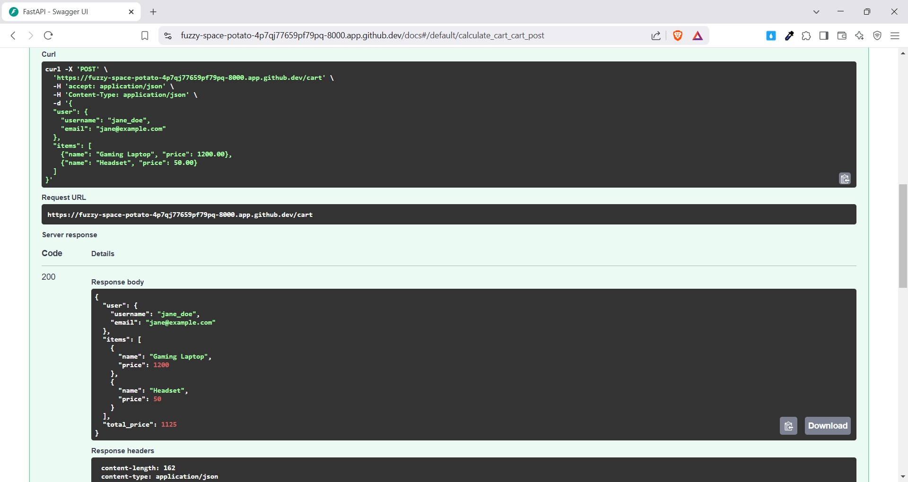

# CS504070 - Homework 8

This repository contains the implementation of Homework 8 for the CS504070 course, which involves creating a FastAPI application with various exercises focusing on request handling, data validation, and business logic.

```sh
Huynh Thanh Liem - 52100813
```

## Exercises Overview

### Exercise 1: Basic Request Body with List Field

- **Objective**: Create a FastAPI application with a POST endpoint `/cart` that accepts a request body containing a list of items.
- **Models**:
  - `Item`: Contains `name` (string) and `price` (float).
  - `Cart`: Contains a list of `Item` instances.
- **Expected Output**: Returns the same JSON structure as input.

- **Result**:


### Exercise 2: Validations for List and Nested Models

- **Objective**: Extend the `Item` model to include validations for `price` (must be greater than 0) and `name` (must be at least 3 characters long). Ensure the `Cart` contains at least one item.
- **Expected Response**: Returns a 400 Bad Request with validation error details if any validation fails.
- **Result**:


### Exercise 3: Nested Models with User Information

- **Objective**: Create a `User ` model with `username` (string, min 3 chars) and `email` (valid email format). Modify `Cart` to include a `user` field.
- **Expected Output**: Returns the user and items in the response.
- **Result**:


### Exercise 4: Calculate Total Price and Apply Discounts

- **Objective**: Extend the `/cart` endpoint to calculate the total price of items. If the total price exceeds $500, apply a 10% discount.
- **Expected Output**: Returns the user, items, and the total price after applying any applicable discounts.
- **Result**:

## How to Run the Application

1. **Install Dependencies**: Make sure you have Python and FastAPI installed. You can install FastAPI and an ASGI server (like `uvicorn`) using pip.

2. **Run the Application**: Navigate to the desired exercise directory and run the application using the command provided in the respective exercise.

3. **Access the API**: Open your browser or use a tool like Postman or `curl` to test the API at `http://localhost:8000/cart`.

## Testing the API

You can test the API using `curl` or any HTTP client. Make sure to send requests that match the expected input format for each exercise to verify the functionality and validation logic.

## Conclusion

This project demonstrates the ability to create a FastAPI application with various features, including data validation, nested models, and business logic for calculating totals and applying discounts. Each exercise builds upon the previous one, showcasing the incremental development of the application.
